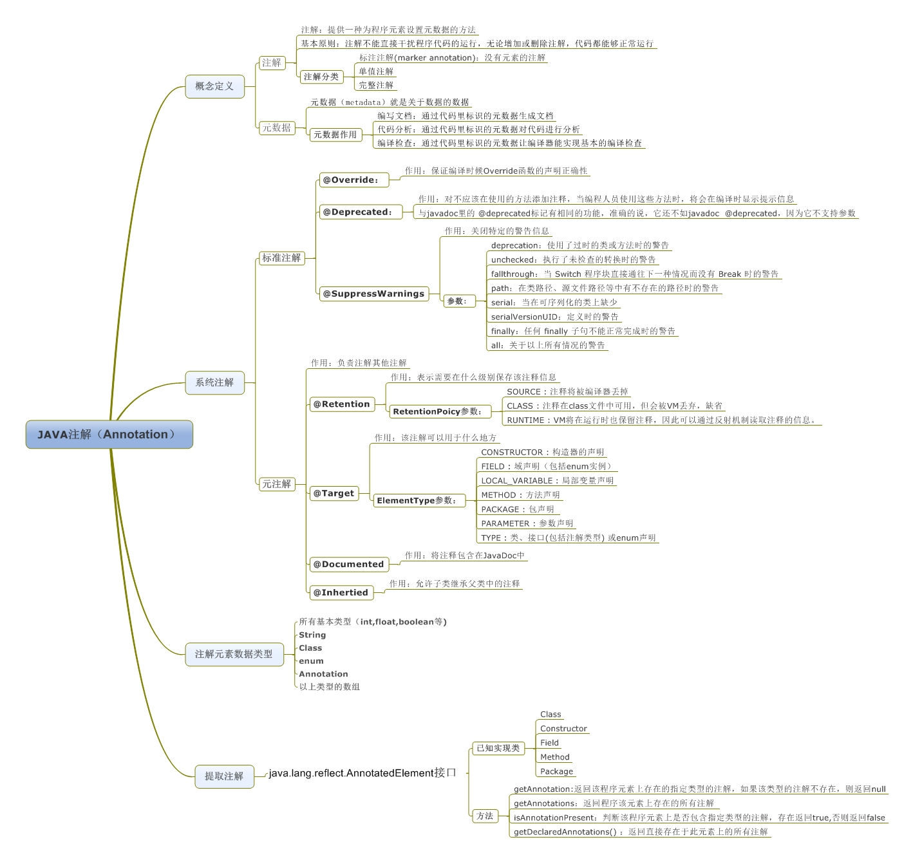

<html> // Tab开头
    <title>Markdown</title>
</html> // 四个空格开头




这是用来 *演示* 的 _文本_

这就是 ~~删除线~~

```
@MyAnnotation(name = "getField", value = 2)
public String getField(@MyAnnotation(name = "input") String input, @MyAnnotation(name = "input1") String input1){
    System.out.println(input);
    return input;
}
window.addEventListener('load', function() {
  console.log('window loaded');
});
```


###有序列表
1.第一层
 + 1-1 
 - 1-2
 * 1-3  
  
2.啊啊啊  
 1. 2-1  
  1.2-1-1


Hello
====
#h1
h2
--
##h2
###h3
####h4

I like [Google](https://www.google.com/)

aaa  
asd<br>aaa


>aaa  *#*
>>aaaaa
>

